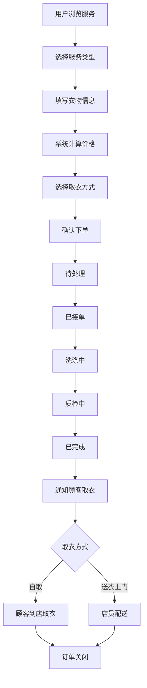

## 1. 产品概述
洗衣店订单管理系统，面向洗衣店经营者和顾客，提供从下单、价格计算、取衣方式选择到订单状态流转的完整业务闭环，并在订单完成后及时通知顾客取衣。

## 2. 核心功能

### 2.1 用户角色
| 角色 | 注册方式 | 核心权限 |
|------|----------|----------|
| 顾客 | 手机号注册 | 浏览服务、下单、查看订单、接收通知 |
| 店员 | 管理员分配账号 | 管理价格、处理订单、更新状态、查看统计 |

### 2.2 功能模块
1. **首页**: 服务项目展示、快速下单入口、订单概览
2. **下单页**: 选择服务项目、填写衣物信息、价格计算、选择取衣方式
3. **订单列表页**: 全部订单查看、按状态筛选、搜索订单
4. **订单详情页**: 订单状态追踪、状态时间线、取衣方式信息
5. **价格管理页**: 服务项目维护、价格调整、特价设置（店员权限）
6. **通知中心**: 完成通知、取衣提醒、系统消息

### 2.3 页面详情
| 页面名称 | 模块名称 | 功能描述 |
|----------|----------|----------|
| 首页 | 服务展示区 | 展示热门服务、快捷下单入口 |
| 首页 | 订单概览区 | 展示进行中/待取衣订单数量 |
| 下单页 | 服务选择 | 选择洗衣/干洗/熨烫等服务类型 |
| 下单页 | 衣物信息 | 填写衣物种类、数量、备注 |
| 下单页 | 价格计算 | 自动计算总价、显示明细 |
| 下单页 | 取衣方式 | 选择自送/上门取送 |
| 下单页 | 联系信息 | 填写联系方式和地址 |
| 订单列表页 | 筛选标签 | 按状态筛选订单 |
| 订单列表页 | 订单卡片 | 显示订单号、状态、金额、时间 |
| 订单详情页 | 状态时间线 | 可视化展示订单各阶段 |
| 订单详情页 | 操作按钮 | 取消订单、确认取衣等操作 |
| 价格管理页 | 服务项目列表 | 增删改服务项目及价格 |
| 价格管理页 | 价格调整 | 修改基础价格、设置特价 |
| 通知中心 | 通知列表 | 按时间展示通知消息 |
| 通知中心 | 通知详情 | 展示通知详细内容 |

## 3. 核心流程

用户打开系统 → 浏览服务项目 → 选择服务类型 → 填写衣物信息 → 系统自动计算价格 → 选择取衣方式 → 确认下单 → 店员接单处理 → 洗涤中 → 质检完成 → 通知顾客 → 顾客取衣 → 订单完成

## 4. 用户界面设计

### 4.1 设计风格
- 主色调：深海蓝(#1B3A5C) + 洁净白(#F8FAFB)，搭配薄荷绿(#3ECFA0)作为强调色
- 按钮风格：圆角(8px)扁平按钮，主要操作使用实色填充，次要操作使用描边
- 字体：标题使用 Noto Serif SC 衬线体体现品质感，正文使用 Noto Sans SC
- 布局风格：左侧导航栏 + 右侧内容区，卡片式布局
- 图标风格：线性图标，2px 描边，与整体简洁风格统一

### 4.2 页面设计概览
| 页面名称 | 模块名称 | UI元素 |
|----------|----------|--------|
| 首页 | 服务展示区 | 卡片网格、悬浮动效、渐变背景 |
| 首页 | 订单概览区 | 数字徽章、状态色块、进度环 |
| 下单页 | 步骤条 | 横向步骤指示器、当前步骤高亮 |
| 下单页 | 价格明细 | 折叠面板、价格加粗、合计醒目 |
| 下单页 | 取衣方式 | 卡片选择器、选中态边框高亮 |
| 订单列表页 | 筛选标签 | 胶囊标签、选中态填充色 |
| 订单列表页 | 订单卡片 | 圆角卡片、状态色带、阴影层次 |
| 订单详情页 | 状态时间线 | 竖向时间线、节点图标、连线动画 |
| 价格管理页 | 服务项目表格 | 斑马纹表格、行内编辑 |
| 通知中心 | 通知列表 | 左侧图标、右侧时间、未读加粗 |

### 4.3 响应式设计
- 桌面端优先设计，最小宽度1200px完整体验
- 平板端(768px-1200px)：侧边栏折叠为图标模式
- 移动端(<768px)：底部Tab导航、全屏卡片布局
- 触摸优化：按钮最小点击区域44px、列表项增加滑动操作
