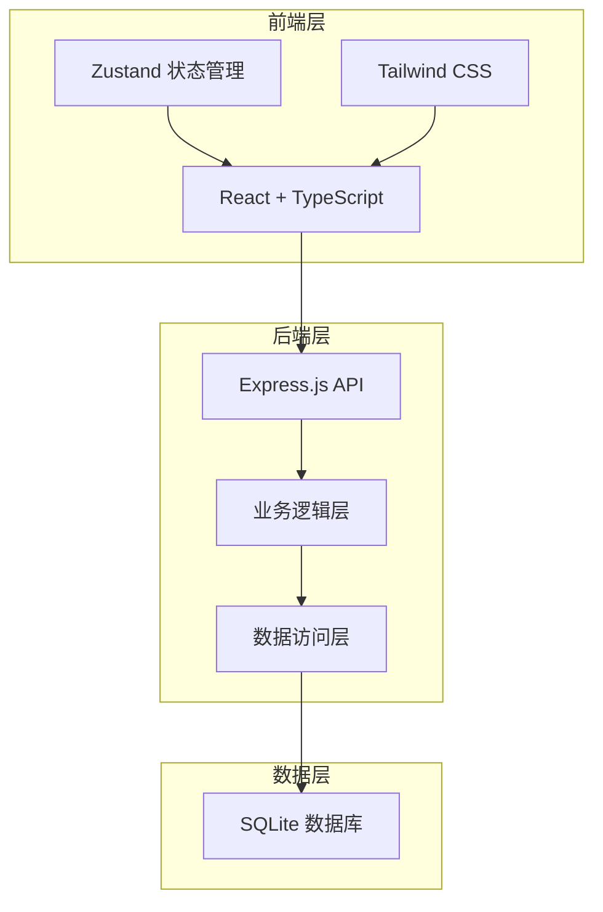
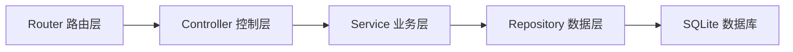
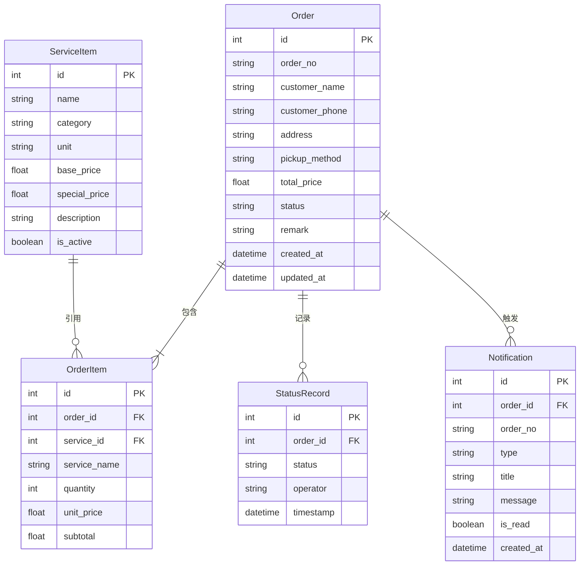

## 1. 架构设计



## 2. 技术说明
- 前端：React@18 + TailwindCSS@3 + Vite
- 初始化工具：vite-init
- 后端：Express@4 + TypeScript (ESM)
- 数据库：SQLite (better-sqlite3)
- 状态管理：Zustand
- 路由：react-router-dom

## 3. 路由定义
| 路由 | 用途 |
|------|------|
| / | 首页，服务展示和订单概览 |
| /order/new | 新建订单页面 |
| /orders | 订单列表页面 |
| /orders/:id | 订单详情页面 |
| /pricing | 价格管理页面 |
| /notifications | 通知中心页面 |

## 4. API 定义

### 4.1 服务项目 API
```
GET    /api/services          - 获取所有服务项目
POST   /api/services          - 创建服务项目
PUT    /api/services/:id      - 更新服务项目
DELETE /api/services/:id      - 删除服务项目
```

### 4.2 订单 API
```
GET    /api/orders             - 获取订单列表（支持状态筛选）
GET    /api/orders/:id         - 获取订单详情
POST   /api/orders             - 创建订单
PUT    /api/orders/:id/status  - 更新订单状态
PUT    /api/orders/:id/cancel  - 取消订单
```

### 4.3 通知 API
```
GET    /api/notifications      - 获取通知列表
PUT    /api/notifications/:id/read - 标记通知已读
GET    /api/notifications/unread - 获取未读数量
```

### 4.4 价格计算 API
```
POST   /api/pricing/calculate  - 计算订单价格
```

### 4.5 类型定义
```typescript
interface ServiceItem {
  id: number
  name: string
  category: string
  unit: string
  basePrice: number
  specialPrice?: number
  description?: string
  isActive: boolean
}

interface OrderItem {
  serviceId: number
  serviceName: string
  quantity: number
  unitPrice: number
  subtotal: number
}

type PickupMethod = 'self' | 'delivery'
type OrderStatus = 'pending' | 'accepted' | 'washing' | 'inspecting' | 'completed' | 'picked_up' | 'cancelled'

interface Order {
  id: number
  orderNo: string
  customerName: string
  customerPhone: string
  address?: string
  pickupMethod: PickupMethod
  items: OrderItem[]
  totalPrice: number
  status: OrderStatus
  remark?: string
  statusHistory: StatusRecord[]
  createdAt: string
  updatedAt: string
}

interface StatusRecord {
  status: OrderStatus
  timestamp: string
  operator: string
}

interface Notification {
  id: number
  orderId: number
  orderNo: string
  type: 'completed' | 'pickup_reminder' | 'system'
  title: string
  message: string
  isRead: boolean
  createdAt: string
}
```

## 5. 服务器架构图



## 6. 数据模型

### 6.1 数据模型定义



### 6.2 数据定义语言

```sql
CREATE TABLE service_items (
  id INTEGER PRIMARY KEY AUTOINCREMENT,
  name TEXT NOT NULL,
  category TEXT NOT NULL,
  unit TEXT NOT NULL DEFAULT '件',
  base_price REAL NOT NULL,
  special_price REAL,
  description TEXT,
  is_active INTEGER NOT NULL DEFAULT 1,
  created_at TEXT NOT NULL DEFAULT (datetime('now')),
  updated_at TEXT NOT NULL DEFAULT (datetime('now'))
);

CREATE TABLE orders (
  id INTEGER PRIMARY KEY AUTOINCREMENT,
  order_no TEXT NOT NULL UNIQUE,
  customer_name TEXT NOT NULL,
  customer_phone TEXT NOT NULL,
  address TEXT,
  pickup_method TEXT NOT NULL CHECK(pickup_method IN ('self', 'delivery')),
  total_price REAL NOT NULL,
  status TEXT NOT NULL DEFAULT 'pending' CHECK(status IN ('pending', 'accepted', 'washing', 'inspecting', 'completed', 'picked_up', 'cancelled')),
  remark TEXT,
  created_at TEXT NOT NULL DEFAULT (datetime('now')),
  updated_at TEXT NOT NULL DEFAULT (datetime('now'))
);

CREATE TABLE order_items (
  id INTEGER PRIMARY KEY AUTOINCREMENT,
  order_id INTEGER NOT NULL,
  service_id INTEGER NOT NULL,
  service_name TEXT NOT NULL,
  quantity INTEGER NOT NULL,
  unit_price REAL NOT NULL,
  subtotal REAL NOT NULL,
  FOREIGN KEY (order_id) REFERENCES orders(id) ON DELETE CASCADE,
  FOREIGN KEY (service_id) REFERENCES service_items(id)
);

CREATE TABLE status_records (
  id INTEGER PRIMARY KEY AUTOINCREMENT,
  order_id INTEGER NOT NULL,
  status TEXT NOT NULL,
  operator TEXT NOT NULL DEFAULT '系统',
  timestamp TEXT NOT NULL DEFAULT (datetime('now')),
  FOREIGN KEY (order_id) REFERENCES orders(id) ON DELETE CASCADE
);

CREATE TABLE notifications (
  id INTEGER PRIMARY KEY AUTOINCREMENT,
  order_id INTEGER NOT NULL,
  order_no TEXT NOT NULL,
  type TEXT NOT NULL CHECK(type IN ('completed', 'pickup_reminder', 'system')),
  title TEXT NOT NULL,
  message TEXT NOT NULL,
  is_read INTEGER NOT NULL DEFAULT 0,
  created_at TEXT NOT NULL DEFAULT (datetime('now')),
  FOREIGN KEY (order_id) REFERENCES orders(id) ON DELETE CASCADE
);

-- 初始服务项目数据
INSERT INTO service_items (name, category, unit, base_price, description) VALUES
  ('水洗衬衫', '水洗', '件', 15.0, '普通衬衫水洗服务'),
  ('水洗裤装', '水洗', '件', 20.0, '裤装水洗服务'),
  ('水洗外套', '水洗', '件', 35.0, '外套水洗服务'),
  ('干洗西装', '干洗', '套', 80.0, '西装干洗服务'),
  ('干洗大衣', '干洗', '件', 60.0, '大衣干洗服务'),
  ('干洗羽绒服', '干洗', '件', 50.0, '羽绒服干洗服务'),
  ('熨烫衬衫', '熨烫', '件', 10.0, '衬衫熨烫服务'),
  ('熨烫裤装', '熨烫', '件', 12.0, '裤装熨烫服务'),
  ('熨烫裙装', '熨烫', '件', 15.0, '裙装熨烫服务'),
  ('奢侈品护理', '特殊护理', '件', 120.0, '高端品牌衣物专业护理'),
  ('皮衣保养', '特殊护理', '件', 100.0, '皮衣清洁上光保养'),
  ('婚纱清洗', '特殊护理', '件', 200.0, '婚纱专业清洗保养');
```
